# Highcharts 入门笔记

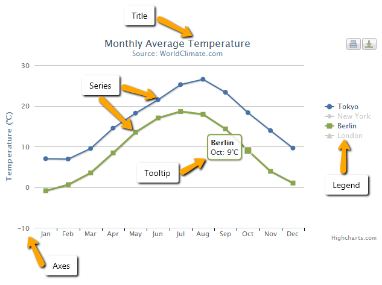

## Title & Subtitle
图表顶部显示的问题，副标题显示在标题下方。
```javascript
title: {
    text: 'My custom title'
},
subtitle: {
    text: 'My custom subtitle'
}
```
可以使用 Chart Option 的 `title` 属性来设置标题的显示方式，[比如对齐、边距](https://api.highcharts.com/highcharts/title)等。 

## Series
图标中展示的一个或多个数据序列

## Tooltip
当鼠标悬停在图标上时显示的数据描述提示

## Axes
图标的坐标轴。包括X坐标和Y坐标。极坐标只有X轴。不同的图表可以包含多个坐标轴。
除了饼形图以外，图表会默认显示X 和 Y 坐标轴。
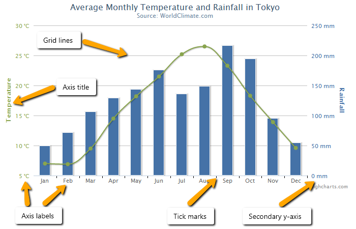

### Axis labels，tickmarks and gridlines
坐标标签、刻度线和网格线是紧密相关的，他们同时缩放，自动计算位置来适合展示的数据。

#### Tick
刻度与坐标一起显示，表示测量的单元。刻度之间的距离有 [`tickInnterval`](https://api.highcharts.com/highcharts/xAxis.tickInterval) 和 [`tickPixelInterval`](https://api.highcharts.com/highcharts/xAxis.tickPixelInterval) 决定。标签和网格线的显示位置与刻度线对应。
在时间轴上，时间是以毫秒计算的。在对数坐标轴中，刻度间隔1表示。

#### Minor ticks
如果设置了 [`minorTickInterval`](https://api.highcharts.com/highcharts/xAxis.minorTickInterval) ，在主刻度线之间还会显示更小单位的刻度和网格线。

#### Labels
坐标轴标签显示在对应的坐标轴旁边，你也可以通过函数来定制它：
```javascript
yAxis: {
    labels: {
        formatter: function() {
            // 在坐标轴标签后增加个 %
            return this.value + '%'
        }
    },
},
```

#### Grid lines

网格线就是图表中水平和竖直的支线，将图表划分成一个个网格，使阅读图表更轻松。你可以通过 [`gridLineWidth`](https://api.highcharts.com/highcharts/xAxis.gridLineWidth) 来开关网格线：
```javascript
xAxis: {
    // 打开X轴网格线
    gridLineWidth: 1
},
yAxis: {
    // 关闭Y轴网格线
    gridLineWidth: 0
}
```

### Multiple axes
你可以在一个图表中的坐标轴使用多组数据，创建多个坐标轴：
```javascript
yAxis: [{   // 主坐标
    title: {
        text: 'Tempratur'
    }
}, {    // 第二个坐标
    title: {
        text: 'Rainfall'
    },
    // 坐标显示在主坐标的对面
    opposite: true
}
],
series: [{
    yAxis: 0,
    data: [49.9, 71.5, 106.4, 129.2, 144.0, 176.0, 135.6, 148.5, 216.4, 194.1, 95.6, 54.4]
}, {
    yAxis: 1,
    data: [7.0, 6.9, 9.5, 14.5, 18.2, 21.5, 25.2, 26.5, 23.3, 18.3, 13.9, 9.6]
}
]
```

### Axisi title
默认显示在Y轴上，X轴的隐藏。参考 [`xAxis。title`](https://api.highcharts.com/highcharts/xAxis.title)  设置X轴标题

### Axis types
坐标类型只能是： linear、logariithmic、datatime 和 categories：
```javascript
yAxis: {
    // 类型可以是 linear，logarithmic，datetime
    type: 'linear',
}
xAxis: {
    // 使用数组来设置 categories
    categories: ['Apples', 'Bananas', 'Oranges']
}
```

#### Linear
坐标轴的默认乐行，表示坐标轴上的数字都是线性变换的。
```javascript
var chart = new Highcharts.Chart({
        chart: {
            renderTo: 'container',
            type: 'column'
        },
        title: {
            text: 'Fruit Consumption'
        },
        xAxis: {
            title: {
                text: 'Fruit Number'
            },
            tickInterval: 1
        },
        yAxis: {
            title: {
                text: 'Fruit eaten'
            },
            tickInterval: 1
        },
        series: [{
            name: 'Jane',
            data: [1, 0, 4]
        }, {
            name: 'John',
            data: [5, 7, 3]
        }]
    }});
```
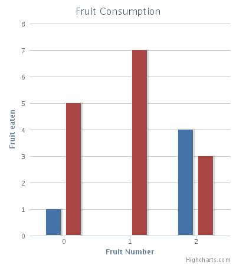

#### Logarithmic
在对数坐标系中，数字成指数增长。在对数坐标中，巴拉巴拉略。。。

#### Datetime
时间日期坐标时间默认始于19700101，也可以通过 JavaScript 的 Date 对象指定。间隔使用毫秒指定。
```javascript
// 获取UTC时间的毫秒数值
Date.UTC(year, month, day, hours, minutes, seconds, millisec)
// 获取本地时间
Date.parse('Month, day, year')
// Highcharts 内置格式化工具
Hightcharts.dataFormat('Month:%m Day:%d Year: %Y', 20, false);
```

注意：Unix 系服务器的时间戳是基于秒的，Hightcharts 使用毫秒作为时间，所以使用系统的时间时要乘以1000。
在Hightcharts Stock 中， X轴永远是时间轴。

#### Categories
用于离散的坐标。参考 [`xAxis.categories`](https://api.highcharts.com/highcharts/xAxis.categories)。

## Series
Seires 就是一个数据集合。Seires 对象数据结构如下：
```javascript
// series 对象是个数组，它的内部可以包含多个数据集
series: [{
    name: '',   // 给数据集一个名字，在图例中和当鼠标悬停显示
    data: []
}]
```

### The data in a series

Series 中的数据有三种形式：
1. 数值列表，Y 轴表述数值，自动计算 X 轴数据（从0开始，自增1或根据 pointStart/pointInterval计算），如果是 categories 类型，也会使用 categories。

```javascript
data: [0, 5, 3, 5]
```
2. 二维数组，第一个数字是X值，第二个是Y值，如果第一个是字符串，它会成为数据点的名字，X轴数据的增长规则与第一种相同。

```javascript
data: [[5, 2], [6, 3], [8, 2]]
```
3. 命名对象列表。在这种情况下，数据对象是一个个点的配置实例。在Hightcharts Stock中，总的数据数量不能超过 [`turboThreshold`](https://api.highcharts.com/highstock/series.line.turboThreshold)，或者 *turboThreshold* 同时变化：

```javascript
data: [{
    name: 'Point 1',
    color: '#00FF00',
    y:  0
}, {
    name: 'Point 2',
    color: '#FF00FF',
    y: 5
}
]
```

### Point and marker
对于笛卡尔坐标系，一个点表示一个坐标对。Hightcharts 支持单独配置数据中的某个点。在蜡烛图中，一个点表示了 （x, open, high, low, close）：
```javascript
series: [{
    data: [29.9, 71.5, 106.4, 129.2, 144.0, 176.0, 135.6, 148.5,
    { y: 216.4, color: '#BF0B23'}, 194.1, 95.6, 54.4]
}]
```

### Series options
Series options 可以在两个地方定义：
- 应用于多个数据集的通用 `plotOptions`.使用 `plotOptions.series` 来设置通用选项。
- 对于特定数据集合的 options，可以在 [`series`](https://api.highcharts.com/highcharts/series) 的 options 的结构中。

#### Animation
开关数据集合显示的动画，默认开启动画。

#### Point selection
选择单个带你，可以用来删除、编辑、显示点信息等。
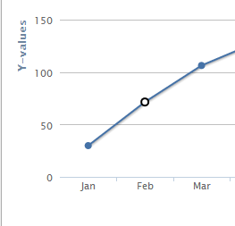
```javascript
plotOptions: {
    series: {
        allowPointSelect: true
    }
}

var selectedPoints = chart.getSelectedPoints();
// 获取选中的点
```

#### Line width
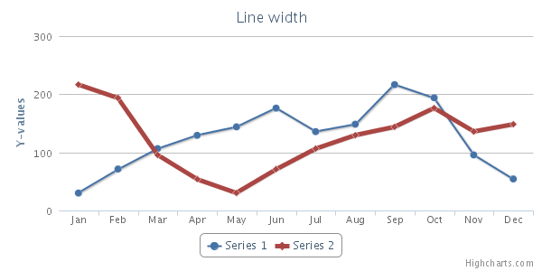
```javascript
series: [{
    data: [216.4, 194.1, 95.6],
    lineWidth: 5}],
```

#### Stacking
使数据显示在其他数据的上边而不会遮挡。参考 [Stacking charts](https://highcharts.com/docs/advanced-chart-features/stacking-charts)。

#### Cursor
允许改变游标来表示点、数据是可以点击的。

#### Data labels
未数据集中的每个数据点线束数据标签。
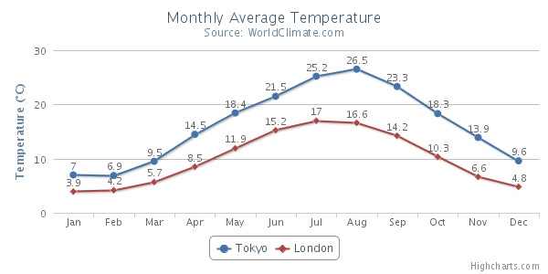
```javascript
plotOptions: {
    line: {
        dataLabels: {
            enabled: true
        }
    }
},
```
你也可以使用 [formatter](https://api.highcharts.com/highcharts/plotOptions.series.dataLabels) 选项来定制标签。


#### Dash style
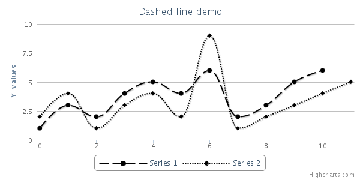
```javascript
series: [{
    data: [1, 3, 2, 4, 5, 4, 6, 2, 3, 5, 6],
    dashStyle: 'longdash'
}]
```

#### Zones
使用 `zones` 和 `zoneAxis` 来根据区域定制图表的 color、fillColor、dashStyle。
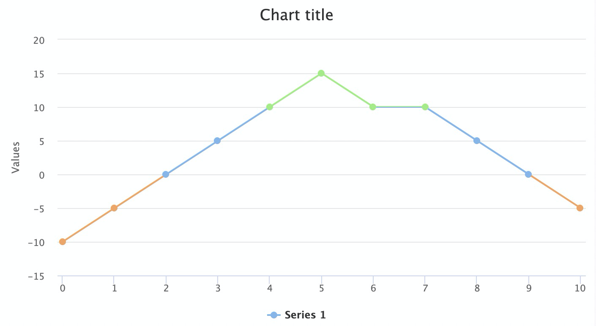
```javascript
zones: [{  
    value: 0,  
    color: '#f7a35c'  
}, {  
    value: 10,  
    color: '#7cb5ec'  
}, {  
    color: '#90ed7d'  
}]
```

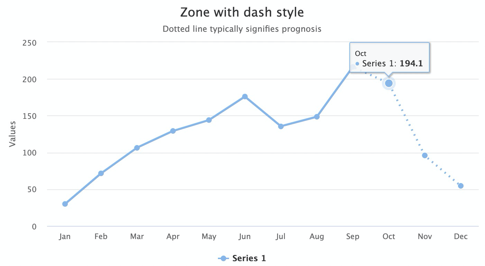
```javascript
zoneAxis: 'x',
zones: [{
    value: 8
}, {
    dashStyle: 'dot'
}]
```

## Tooltip
鼠标悬停时显示的提示，默认显示当前点的值和名字， 参考 [api.highcharts.com#tooltip](https://api.highcharts.com/highcharts/tooltip) 。
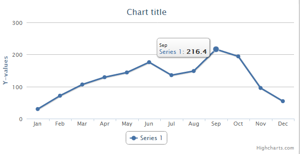
#### Appearance
定制提示的外观
```javascript
tooltip: {
    backgroundColor: '#FCFFC5',
    borderColor: 'black',
    borderRadius: 10,
    borderWidth: 3
}
```

#### Tooltip formatting
tooltip 的内容是从 HTML 来渲染的，可以通过多种方式来 定制

## Stock

### Understanding Highcharts Stock
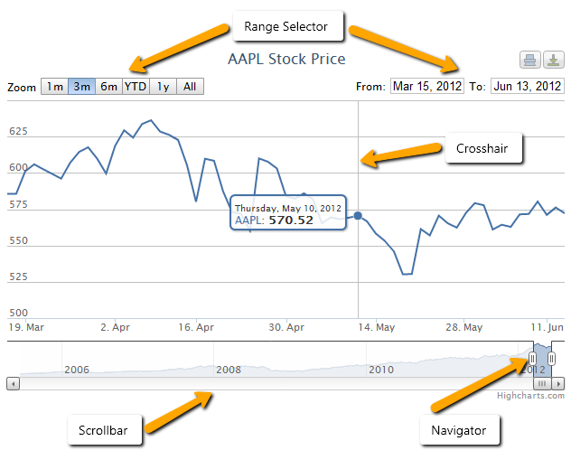

### Stock tools
Stock tools 是Hightcharts的一个模块，它可以让用户的交互与图表交互，比如增加标注、技术指标、缩放等。用于用户交互的 HTML 元素用户事件与 Stock tools 模块绑定，参考 [navigation.bindings](https://api.highcharts.com/highstock/navigation.bindings)。

#### Quick start
使用默认的toolbar和 stock tools，必须以下边的书序载入对应的JavaScript。

1. 为了简化使用，你可以直接调用 `<script src="https://code.highcharts.com/indicators/indicators-all.js"></script>` 直接载入所有的技术指标。或者也可以按需载入：
```javascript
// 这个语句是必须的，是技术指标的基础模块，它的内部包含了 SMA
<script src="https://code.highcharts.com/indicators/indicators.js"></script>
<script src="https://code.highcharts.com/indicators/rsi.js"></script>
<script src="https://code.highcharts.com/indicators/ema.js"></script> 
<script src="https://code.highcharts.com/indicators/macd.js"></script> 
<script src="/ .... other technical indicators ...  "
```

2. 载入默认toolbar需要的其他模块： resizable panes、Annotations、Full screen和 current price。

```javascript
<script src="https://code.highcharts.com/modules/drag-panes.js"></script>
<script src="https://code.highcharts.com/modules/annotations-advanced.js"></script>
<script src="https://code.highcharts.com/modules/price-indicator.js"></script>
<script src="https://code.highcharts.com/modules/full-screen.js"></script>
```
3. 最后载入 Stock Tools 模块，它会使用上边所有的模块，将他们整合在一起：

```javascript
<script src="https://code.highcharts.com/modules/stock-tools.js">
```
4. 内置的 toolbar 需要使用下边的 CSS 文件：

```javascript
<link rel="stylesheet" type="text/css" href="https://code.highcharts.com/css/stocktools/gui.css">
<link rel="stylesheet" type="text/css" href="https://code.highcharts.com/css/annotations/popup.css">
```
5. 现在所有的依赖都满足了，你可以创建自己的图表了：

```javascript
Highcharts.stockChart('container', {
    series: [{
        type: 'ohlc',
            data: [ ... ]
        }]
    });
```

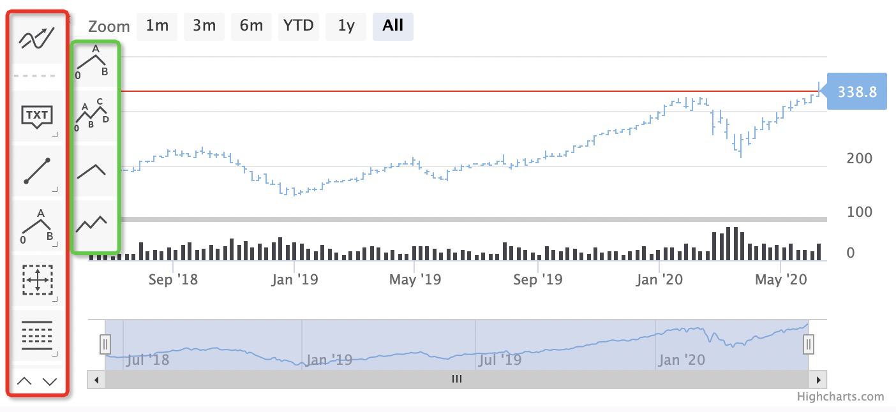

#### Build a custom UI
默认的 Stock Toolbar 可以覆盖多数的用户场景了。同时也支持定制UI。

##### Binding an event to a HTML element

HTML 元素可以通过元素逆向查找实现，通过 `highcharts-BINDINGNAME` 的 classname 查找。比如 HTML 按钮 `hightcharts-circle-annotation` 将会被绑定到 [navigation.binding.circleAnnotation](https://api.highcharts.com/highstock/navigation.bindings.circleAnnotation) 事件。
